Analysis of recent coronavirus data for different countries and regions.  
Author: Javier Moldon  
More info in https://github.com/jmoldon/coronavirus_analysis

# General statistics

Data comes from Johns Hopkins University at https://github.com/CSSEGISandData/COVID-19 that is updated daily.

## List of most affected countries (sorted by number of confirmed cases)

<table border="1" class="dataframe">
  <thead>
    <tr style="text-align: right;">
      <th></th>
      <th>Confirmed</th>
      <th>Deaths</th>
      <th>Recovered</th>
    </tr>
    <tr>
      <th>Country/Region</th>
      <th></th>
      <th></th>
      <th></th>
    </tr>
  </thead>
  <tbody>
    <tr>
      <th>China</th>
      <td>67790</td>
      <td>3075</td>
      <td>52960</td>
    </tr>
    <tr>
      <th>Italy</th>
      <td>21157</td>
      <td>1441</td>
      <td>1966</td>
    </tr>
    <tr>
      <th>Iran</th>
      <td>12729</td>
      <td>611</td>
      <td>2959</td>
    </tr>
    <tr>
      <th>Korea, South</th>
      <td>8086</td>
      <td>72</td>
      <td>510</td>
    </tr>
    <tr>
      <th>Spain</th>
      <td>6391</td>
      <td>195</td>
      <td>517</td>
    </tr>
    <tr>
      <th>Germany</th>
      <td>4585</td>
      <td>9</td>
      <td>46</td>
    </tr>
    <tr>
      <th>France</th>
      <td>4469</td>
      <td>91</td>
      <td>12</td>
    </tr>
    <tr>
      <th>Switzerland</th>
      <td>1359</td>
      <td>13</td>
      <td>4</td>
    </tr>
    <tr>
      <th>United Kingdom</th>
      <td>1140</td>
      <td>21</td>
      <td>18</td>
    </tr>
    <tr>
      <th>Norway</th>
      <td>1090</td>
      <td>3</td>
      <td>1</td>
    </tr>
    <tr>
      <th>Sweden</th>
      <td>961</td>
      <td>2</td>
      <td>1</td>
    </tr>
    <tr>
      <th>Netherlands</th>
      <td>959</td>
      <td>12</td>
      <td>2</td>
    </tr>
    <tr>
      <th>Denmark</th>
      <td>827</td>
      <td>1</td>
      <td>1</td>
    </tr>
    <tr>
      <th>Japan</th>
      <td>773</td>
      <td>22</td>
      <td>118</td>
    </tr>
    <tr>
      <th>Cruise Ship</th>
      <td>706</td>
      <td>7</td>
      <td>325</td>
    </tr>
  </tbody>
</table>

## List of most affected countries/provinces (sorted by number of deaths)

<table border="1" class="dataframe">
  <thead>
    <tr style="text-align: right;">
      <th></th>
      <th></th>
      <th>Confirmed</th>
      <th>Deaths</th>
      <th>Recovered</th>
    </tr>
    <tr>
      <th>Country/Region</th>
      <th>Province/State</th>
      <th></th>
      <th></th>
      <th></th>
    </tr>
  </thead>
  <tbody>
    <tr>
      <th>China</th>
      <th>Hubei</th>
      <td>67790</td>
      <td>3075</td>
      <td>52960</td>
    </tr>
    <tr>
      <th>Italy</th>
      <th></th>
      <td>21157</td>
      <td>1441</td>
      <td>1966</td>
    </tr>
    <tr>
      <th>Iran</th>
      <th></th>
      <td>12729</td>
      <td>611</td>
      <td>2959</td>
    </tr>
    <tr>
      <th>Spain</th>
      <th></th>
      <td>6391</td>
      <td>195</td>
      <td>517</td>
    </tr>
    <tr>
      <th>France</th>
      <th>France</th>
      <td>4469</td>
      <td>91</td>
      <td>12</td>
    </tr>
    <tr>
      <th>Korea, South</th>
      <th></th>
      <td>8086</td>
      <td>72</td>
      <td>510</td>
    </tr>
    <tr>
      <th>US</th>
      <th>Washington</th>
      <td>572</td>
      <td>37</td>
      <td>1</td>
    </tr>
    <tr>
      <th>China</th>
      <th>Henan</th>
      <td>1273</td>
      <td>22</td>
      <td>1250</td>
    </tr>
    <tr>
      <th>Japan</th>
      <th></th>
      <td>773</td>
      <td>22</td>
      <td>118</td>
    </tr>
    <tr>
      <th>United Kingdom</th>
      <th>United Kingdom</th>
      <td>1140</td>
      <td>21</td>
      <td>18</td>
    </tr>
    <tr>
      <th>US</th>
      <th>King County, WA</th>
      <td>83</td>
      <td>17</td>
      <td>1</td>
    </tr>
    <tr>
      <th>Switzerland</th>
      <th></th>
      <td>1359</td>
      <td>13</td>
      <td>4</td>
    </tr>
    <tr>
      <th>China</th>
      <th>Heilongjiang</th>
      <td>482</td>
      <td>13</td>
      <td>447</td>
    </tr>
    <tr>
      <th>Netherlands</th>
      <th></th>
      <td>959</td>
      <td>12</td>
      <td>2</td>
    </tr>
    <tr>
      <th>Iraq</th>
      <th></th>
      <td>110</td>
      <td>10</td>
      <td>26</td>
    </tr>
  </tbody>
</table>

# Evolution of cases (Confirmed, Deaths, Active and Recovery) per country

All plots have the same information. Left: log scale, right: linear scale. Bottom-right: is a zoom to show the correct scale for deaths. The straight line is a fit to a logistic growth when possible. If the fit does not converge (low number of points in early stages) a simple exponential is used. The dashed line is a prediction based on the fit. 

## Early onset: China regions

Most of the regions have almost completed the cycle and active cases are disappearing. Note that China Hubei (the original area) has a large number of confirmed cases (70000), but the other regions have very low number of cases, with number around 1200-500 or even less.

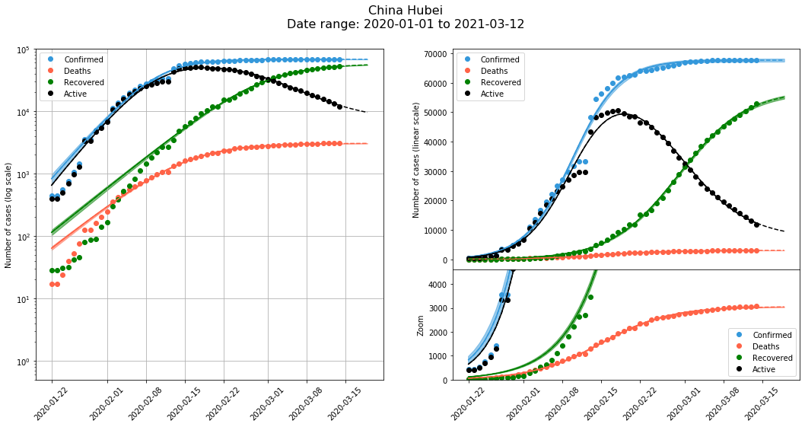

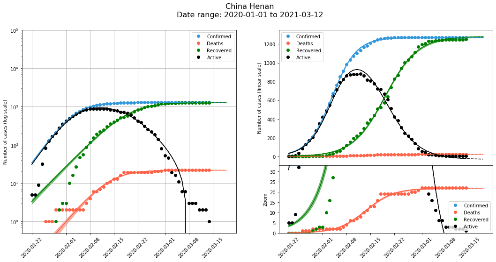

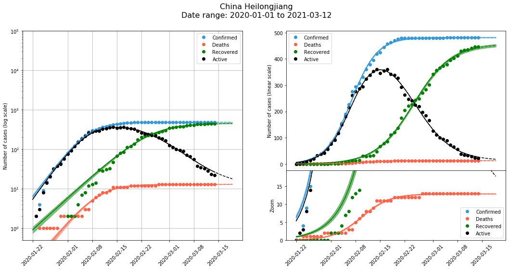

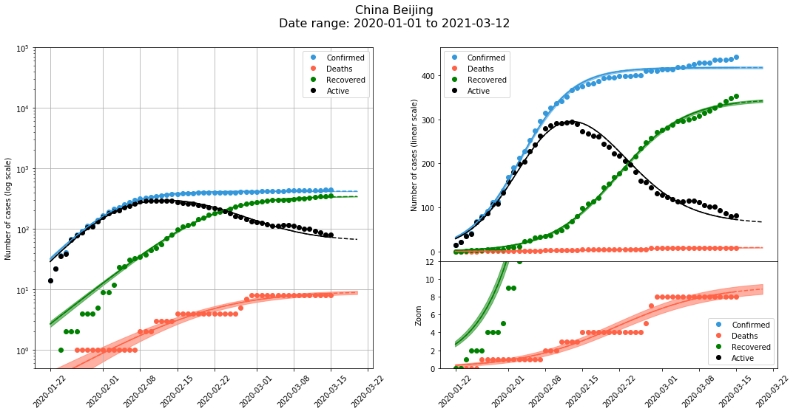

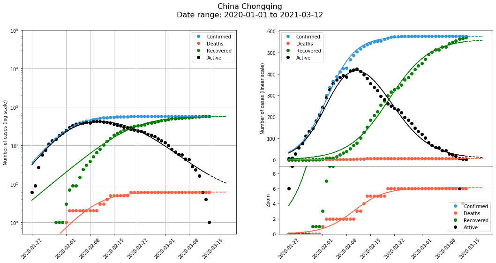

## Europe

The number of confirmed cases and deaths is very high in countries like Italy, Spain and France. Note high rate of deaths, much higher than in , which is still in very exponential stage with some signs of flattening.

In general, more days will be needed for a more accurate fit and prediction, but we are still in a high-growth phase.  
2020-03-15: Italy seems to start showing a flattening of the Death curve, finally!  

2020-03-15: Spain shows a weird behaviour in the early Confirmed cases. For all countries, the first data points are below the fitted curve, but Spain is the other way, and there seems to be a change in the rate of new cases on about March 07. Something happened a week before to cause this significant change?

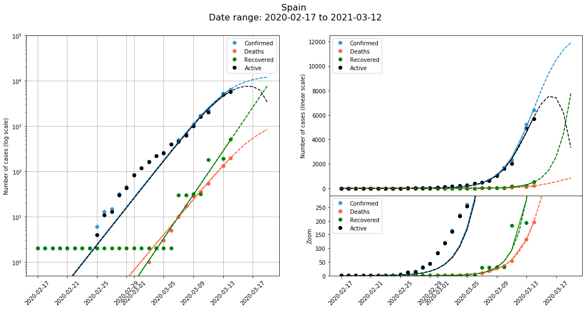

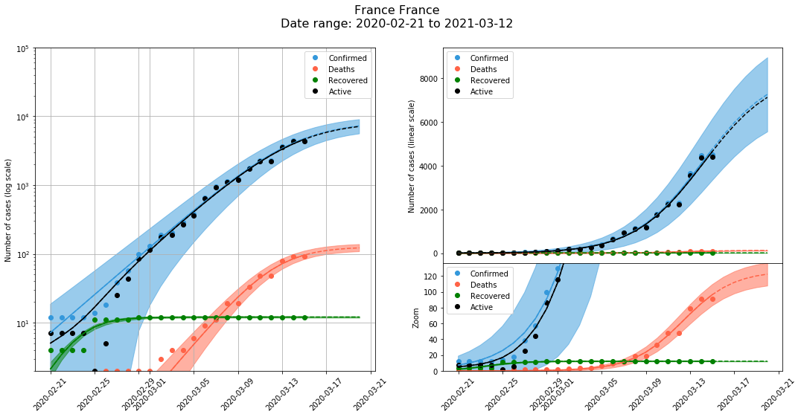

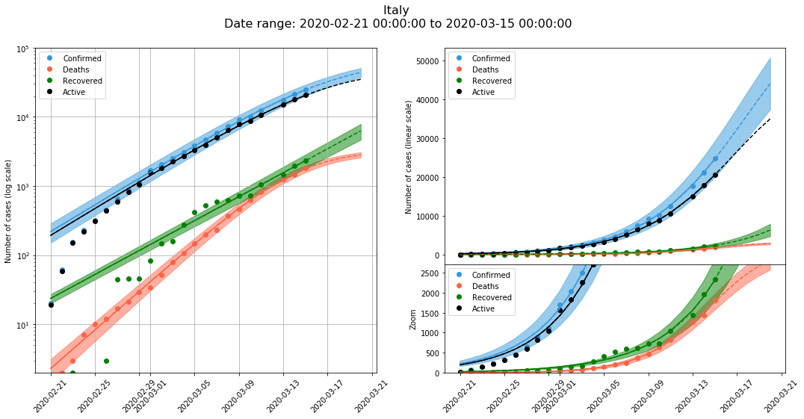

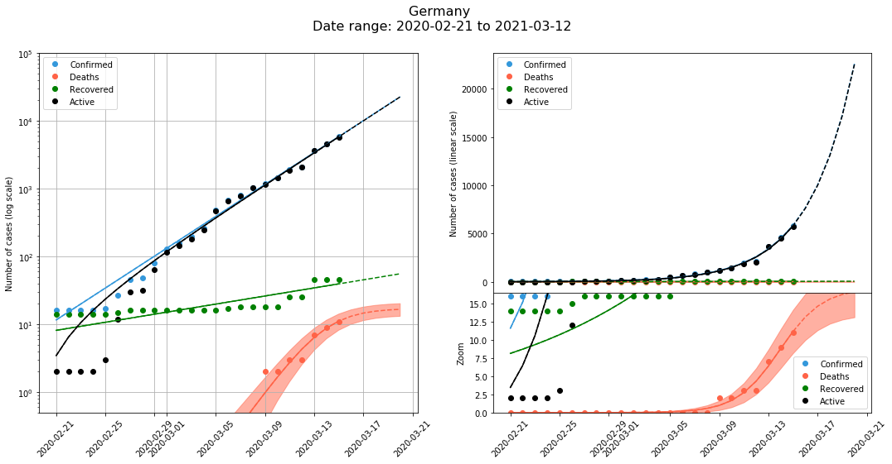

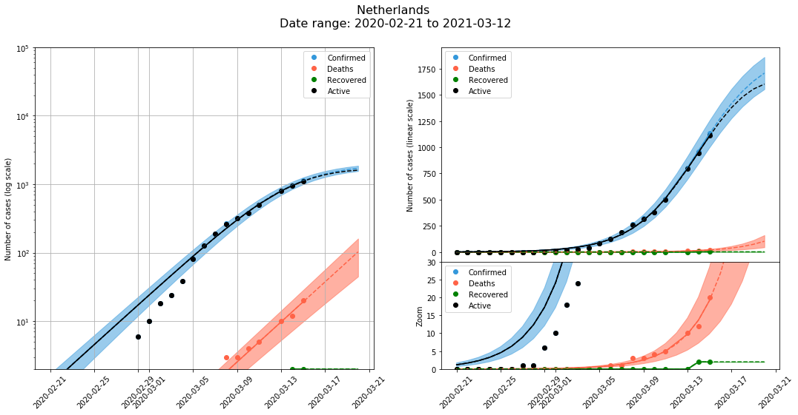

## Other countries in Asia

South Korea has a remarkable recovery rate, with many cases and a reduced number of deaths. Japan growth is moderate, much smaller than in European countries. Iran is showing hints of flattening, although it is curious that the number of recoveries has significantly slowed down while the number of deaths still follow a very exponential trend.

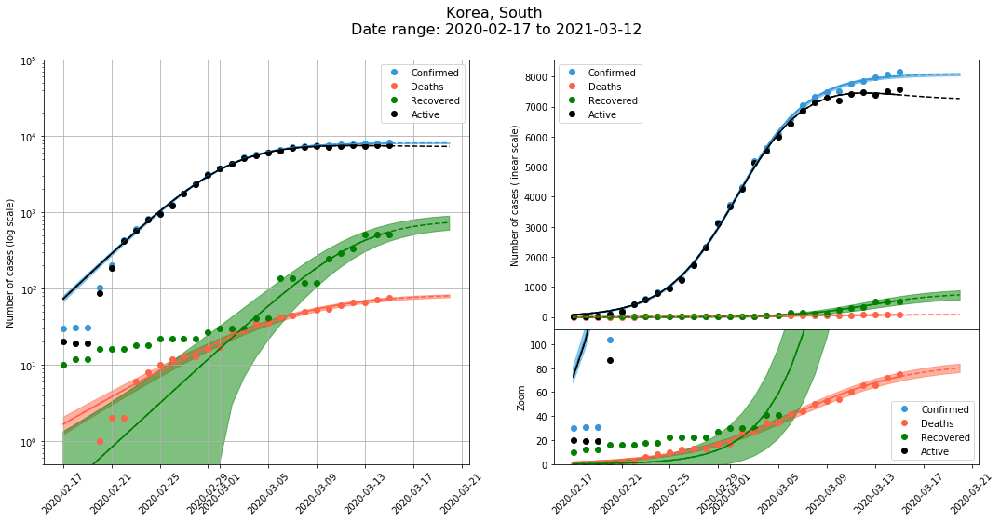

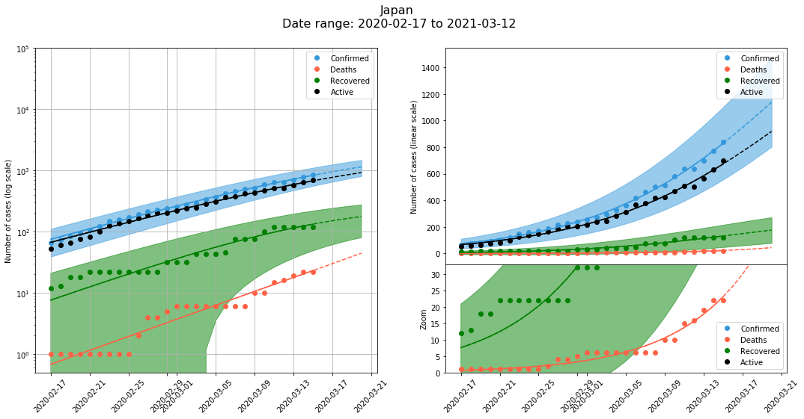

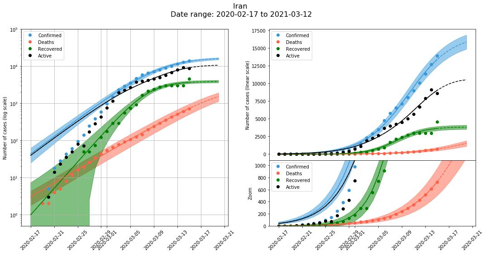

# United States

The number of days with cases is still very low, and the fits are not very informative.

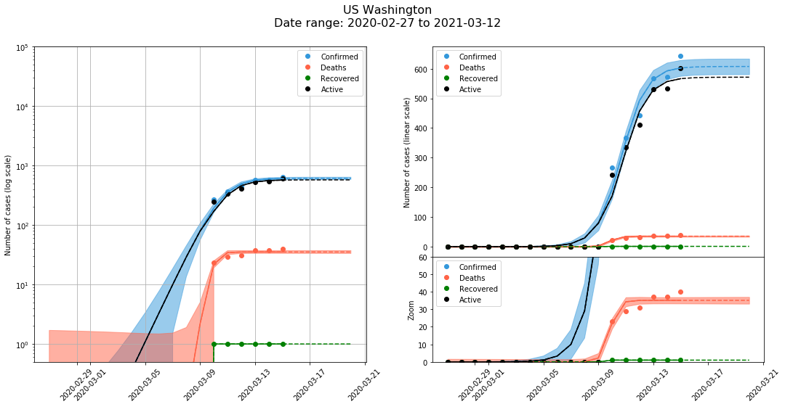

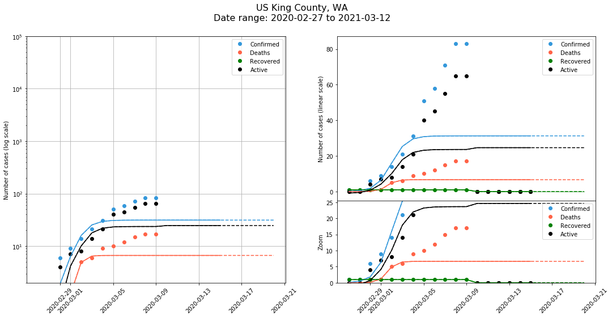

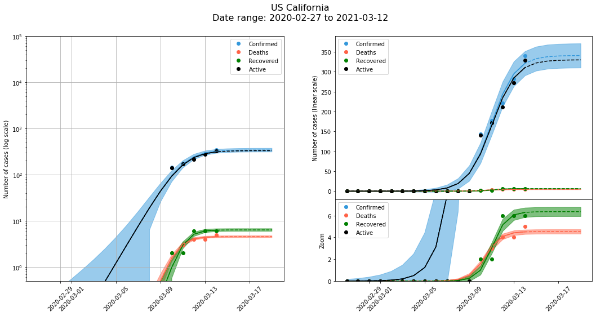

# Comparison of two countries, with a manual time delay to align them

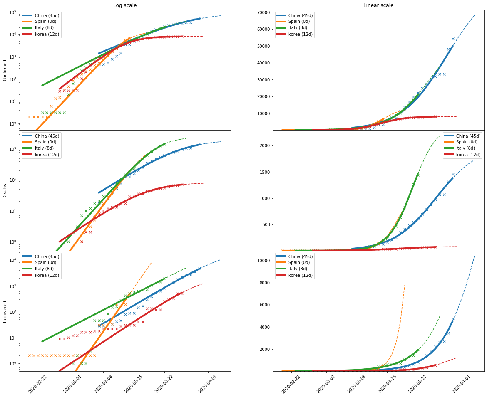

