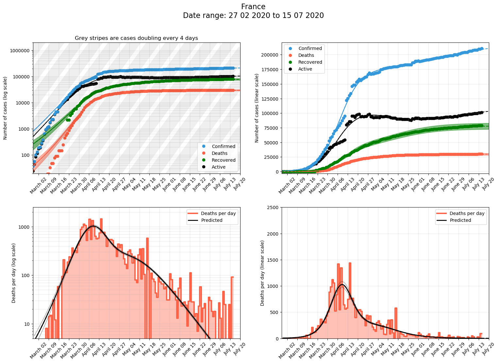

Analysis of recent coronavirus data for different countries and regions. Data comes from Johns Hopkins University at https://github.com/CSSEGISandData/COVID-19 that is updated daily.

The latest report can be found in different formats here:

- html https://jmoldon.github.io/coronavirus_analysis/cvid_report.html
- pdf https://jmoldon.github.io/coronavirus_analysis/cvid_report.pdf

# Changelog

2020-03-17
- Mayor refactoring and new functions. 
- Now the report displays predicted number of cases for the next 10 days
- Included USA as aggregated country
- Included Poland 
2020-03-16 
- Better determination of exponential curve.
2020-03-15 
- Add confidence interval calculation. Add Germany
