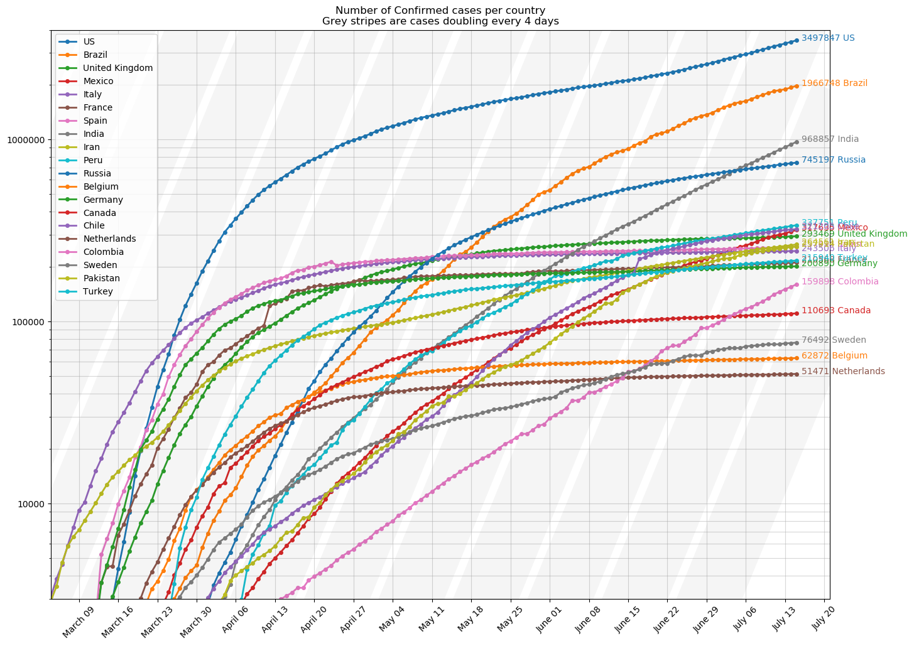
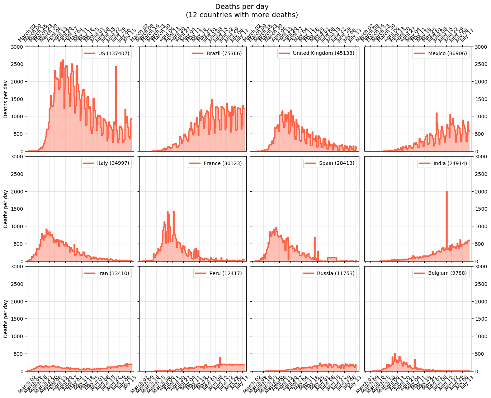
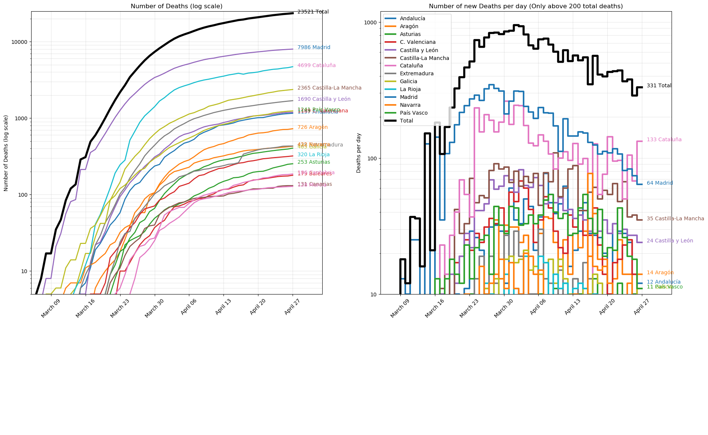
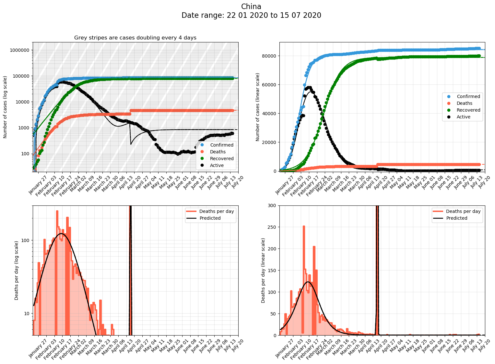

# Analyis of the evolution of covid-19 cases with time

Analysis of recent coronavirus data for different countries and regions.

Main report is here: [https://jmoldon.github.io/coronavirus_analysis/cvid_report.html](https://jmoldon.github.io/coronavirus_analysis/cvid_report.html)

Data comes from [Johns Hopkins University](https://github.com/CSSEGISandData/COVID-19) that is updated daily.

# Some sample plots
### Response comparison China vs the rest

### Individual countries

# Changelog
2020-04-11
- Add plot of deaths per day for 12 countries combined
- Fix date tick labels to be one per week (on Mondays)
- More clear date tick label format

2020-04-04
- Add plots for Spain by Comunidades Autónomas

2020-03-25
- Added prediction to the number of deaths per day plot
- Changed zorder of Active plots to be lower

2020-03-24
- Have to change the source of data because JHU has changed the format unconsistently and have removed the Recovered data

2020-03-23
- Add increments to all predictions

2020-03-22
- Add stripes to show rate of doubling cases every 2 days
- Fix bug with case differences in the tables
- Added USA per State in the global summary

2020-03-21
- Major refactor of some functions
- Now death rate (per day) is plotted 

2020-03-17
- Mayor refactoring and new functions. 
- Now the report displays predicted number of cases for the next 5 days
- Included USA as aggregated country
- Included Poland
- bound_threshold parameter to manually disable confidence intervals
- Add global plots of evolution of most affected countries over time

2020-03-16 
- Better determination of exponential curve.
- exponential or logistic function is automatically selected based on goodness of fit

2020-03-15 
- Add confidence interval calculation. Add Germany
