Analysis of recent coronavirus data for different countries and regions.  
Author: Javier Moldon  
More info in https://github.com/jmoldon/coronavirus_analysis

# General statistics

Data comes from Johns Hopkins University at https://github.com/CSSEGISandData/COVID-19 that is updated daily.

## List of most affected countries (sorted by number of confirmed cases)

<table border="1" class="dataframe">
  <thead>
    <tr style="text-align: right;">
      <th></th>
      <th></th>
      <th>Confirmed</th>
      <th>Deaths</th>
      <th>Recovered</th>
    </tr>
    <tr>
      <th>Country/Region</th>
      <th>Province/State</th>
      <th></th>
      <th></th>
      <th></th>
    </tr>
  </thead>
  <tbody>
    <tr>
      <th>China</th>
      <th>Hubei</th>
      <td>67798</td>
      <td>3099</td>
      <td>55142</td>
    </tr>
    <tr>
      <th>Italy</th>
      <th></th>
      <td>27980</td>
      <td>2158</td>
      <td>2749</td>
    </tr>
    <tr>
      <th>Iran</th>
      <th></th>
      <td>14991</td>
      <td>853</td>
      <td>4590</td>
    </tr>
    <tr>
      <th>Spain</th>
      <th></th>
      <td>9942</td>
      <td>342</td>
      <td>530</td>
    </tr>
    <tr>
      <th>Korea, South</th>
      <th></th>
      <td>8236</td>
      <td>75</td>
      <td>1137</td>
    </tr>
    <tr>
      <th>Germany</th>
      <th></th>
      <td>7272</td>
      <td>17</td>
      <td>67</td>
    </tr>
    <tr>
      <th>France</th>
      <th>France</th>
      <td>6633</td>
      <td>148</td>
      <td>12</td>
    </tr>
    <tr>
      <th>Switzerland</th>
      <th></th>
      <td>2200</td>
      <td>14</td>
      <td>4</td>
    </tr>
    <tr>
      <th>United Kingdom</th>
      <th>United Kingdom</th>
      <td>1543</td>
      <td>55</td>
      <td>20</td>
    </tr>
    <tr>
      <th>Netherlands</th>
      <th>Netherlands</th>
      <td>1413</td>
      <td>24</td>
      <td>2</td>
    </tr>
    <tr>
      <th>China</th>
      <th>Guangdong</th>
      <td>1361</td>
      <td>8</td>
      <td>1306</td>
    </tr>
    <tr>
      <th>Norway</th>
      <th></th>
      <td>1333</td>
      <td>3</td>
      <td>1</td>
    </tr>
    <tr>
      <th rowspan="2" valign="top">China</th>
      <th>Henan</th>
      <td>1273</td>
      <td>22</td>
      <td>1250</td>
    </tr>
    <tr>
      <th>Zhejiang</th>
      <td>1231</td>
      <td>1</td>
      <td>1216</td>
    </tr>
    <tr>
      <th>Sweden</th>
      <th></th>
      <td>1103</td>
      <td>6</td>
      <td>1</td>
    </tr>
    <tr>
      <th>Belgium</th>
      <th></th>
      <td>1058</td>
      <td>5</td>
      <td>1</td>
    </tr>
    <tr>
      <th>China</th>
      <th>Hunan</th>
      <td>1018</td>
      <td>4</td>
      <td>1014</td>
    </tr>
    <tr>
      <th>Austria</th>
      <th></th>
      <td>1018</td>
      <td>3</td>
      <td>6</td>
    </tr>
    <tr>
      <th>China</th>
      <th>Anhui</th>
      <td>990</td>
      <td>6</td>
      <td>984</td>
    </tr>
    <tr>
      <th>US</th>
      <th>New York</th>
      <td>967</td>
      <td>10</td>
      <td>0</td>
    </tr>
  </tbody>
</table>

## List of most affected countries/provinces (sorted by number of deaths)

<table border="1" class="dataframe">
  <thead>
    <tr style="text-align: right;">
      <th></th>
      <th></th>
      <th>Confirmed</th>
      <th>Deaths</th>
      <th>Recovered</th>
    </tr>
    <tr>
      <th>Country/Region</th>
      <th>Province/State</th>
      <th></th>
      <th></th>
      <th></th>
    </tr>
  </thead>
  <tbody>
    <tr>
      <th>China</th>
      <th>Hubei</th>
      <td>67798</td>
      <td>3099</td>
      <td>55142</td>
    </tr>
    <tr>
      <th>Italy</th>
      <th></th>
      <td>27980</td>
      <td>2158</td>
      <td>2749</td>
    </tr>
    <tr>
      <th>Iran</th>
      <th></th>
      <td>14991</td>
      <td>853</td>
      <td>4590</td>
    </tr>
    <tr>
      <th>Spain</th>
      <th></th>
      <td>9942</td>
      <td>342</td>
      <td>530</td>
    </tr>
    <tr>
      <th>France</th>
      <th>France</th>
      <td>6633</td>
      <td>148</td>
      <td>12</td>
    </tr>
    <tr>
      <th>Korea, South</th>
      <th></th>
      <td>8236</td>
      <td>75</td>
      <td>1137</td>
    </tr>
    <tr>
      <th>United Kingdom</th>
      <th>United Kingdom</th>
      <td>1543</td>
      <td>55</td>
      <td>20</td>
    </tr>
    <tr>
      <th>US</th>
      <th>Washington</th>
      <td>904</td>
      <td>48</td>
      <td>1</td>
    </tr>
    <tr>
      <th>Japan</th>
      <th></th>
      <td>839</td>
      <td>27</td>
      <td>144</td>
    </tr>
    <tr>
      <th>Netherlands</th>
      <th>Netherlands</th>
      <td>1413</td>
      <td>24</td>
      <td>2</td>
    </tr>
    <tr>
      <th>China</th>
      <th>Henan</th>
      <td>1273</td>
      <td>22</td>
      <td>1250</td>
    </tr>
    <tr>
      <th>US</th>
      <th>King County, WA</th>
      <td>83</td>
      <td>17</td>
      <td>1</td>
    </tr>
    <tr>
      <th>Germany</th>
      <th></th>
      <td>7272</td>
      <td>17</td>
      <td>67</td>
    </tr>
    <tr>
      <th>Switzerland</th>
      <th></th>
      <td>2200</td>
      <td>14</td>
      <td>4</td>
    </tr>
    <tr>
      <th>China</th>
      <th>Heilongjiang</th>
      <td>482</td>
      <td>13</td>
      <td>455</td>
    </tr>
    <tr>
      <th>Philippines</th>
      <th></th>
      <td>142</td>
      <td>12</td>
      <td>2</td>
    </tr>
    <tr>
      <th>US</th>
      <th>New York</th>
      <td>967</td>
      <td>10</td>
      <td>0</td>
    </tr>
    <tr>
      <th>Iraq</th>
      <th></th>
      <td>124</td>
      <td>10</td>
      <td>26</td>
    </tr>
    <tr>
      <th rowspan="2" valign="top">China</th>
      <th>Guangdong</th>
      <td>1361</td>
      <td>8</td>
      <td>1306</td>
    </tr>
    <tr>
      <th>Beijing</th>
      <td>452</td>
      <td>8</td>
      <td>360</td>
    </tr>
  </tbody>
</table>

# Evolution of cases (Confirmed, Deaths, Active and Recovery) per country

All plots have the same information. Left: log scale, right: linear scale. Bottom-right: is a zoom to show the correct scale for deaths. The straight line is a fit to a logistic growth when possible. If the fit does not converge (low number of points in early stages) a simple exponential is used. The dashed line is a prediction based on the fit. 

# Europe

## Spain

#### 5 day prediction

<table id="T_3c2791c2_687b_11ea_9c93_8560f2674376" ><thead>    <tr>        <th class="blank level0" ></th>        <th class="col_heading level0 col0" >Date (end of)</th>        <th class="col_heading level0 col1" >Confirmed</th>        <th class="col_heading level0 col2" >Deaths</th>        <th class="col_heading level0 col3" >Recovered</th>    </tr></thead><tbody>
                <tr>
                        <th id="T_3c2791c2_687b_11ea_9c93_8560f2674376level0_row0" class="row_heading level0 row0" >25</th>
                        <td id="T_3c2791c2_687b_11ea_9c93_8560f2674376row0_col0" class="data row0 col0" >Tuesday 17 March 2020</td>
                        <td id="T_3c2791c2_687b_11ea_9c93_8560f2674376row0_col1" class="data row0 col1" >13785</td>
                        <td id="T_3c2791c2_687b_11ea_9c93_8560f2674376row0_col2" class="data row0 col2" >513</td>
                        <td id="T_3c2791c2_687b_11ea_9c93_8560f2674376row0_col3" class="data row0 col3" >831</td>
            </tr>
            <tr>
                        <th id="T_3c2791c2_687b_11ea_9c93_8560f2674376level0_row1" class="row_heading level0 row1" >26</th>
                        <td id="T_3c2791c2_687b_11ea_9c93_8560f2674376row1_col0" class="data row1 col0" >Wednesday 18 March 2020</td>
                        <td id="T_3c2791c2_687b_11ea_9c93_8560f2674376row1_col1" class="data row1 col1" >18330</td>
                        <td id="T_3c2791c2_687b_11ea_9c93_8560f2674376row1_col2" class="data row1 col2" >722</td>
                        <td id="T_3c2791c2_687b_11ea_9c93_8560f2674376row1_col3" class="data row1 col3" >1113</td>
            </tr>
            <tr>
                        <th id="T_3c2791c2_687b_11ea_9c93_8560f2674376level0_row2" class="row_heading level0 row2" >27</th>
                        <td id="T_3c2791c2_687b_11ea_9c93_8560f2674376row2_col0" class="data row2 col0" >Thursday 19 March 2020</td>
                        <td id="T_3c2791c2_687b_11ea_9c93_8560f2674376row2_col1" class="data row2 col1" >24374</td>
                        <td id="T_3c2791c2_687b_11ea_9c93_8560f2674376row2_col2" class="data row2 col2" >1017</td>
                        <td id="T_3c2791c2_687b_11ea_9c93_8560f2674376row2_col3" class="data row2 col3" >1491</td>
            </tr>
            <tr>
                        <th id="T_3c2791c2_687b_11ea_9c93_8560f2674376level0_row3" class="row_heading level0 row3" >28</th>
                        <td id="T_3c2791c2_687b_11ea_9c93_8560f2674376row3_col0" class="data row3 col0" >Friday 20 March 2020</td>
                        <td id="T_3c2791c2_687b_11ea_9c93_8560f2674376row3_col1" class="data row3 col1" >32410</td>
                        <td id="T_3c2791c2_687b_11ea_9c93_8560f2674376row3_col2" class="data row3 col2" >1432</td>
                        <td id="T_3c2791c2_687b_11ea_9c93_8560f2674376row3_col3" class="data row3 col3" >1998</td>
            </tr>
            <tr>
                        <th id="T_3c2791c2_687b_11ea_9c93_8560f2674376level0_row4" class="row_heading level0 row4" >29</th>
                        <td id="T_3c2791c2_687b_11ea_9c93_8560f2674376row4_col0" class="data row4 col0" >Saturday 21 March 2020</td>
                        <td id="T_3c2791c2_687b_11ea_9c93_8560f2674376row4_col1" class="data row4 col1" >43095</td>
                        <td id="T_3c2791c2_687b_11ea_9c93_8560f2674376row4_col2" class="data row4 col2" >2016</td>
                        <td id="T_3c2791c2_687b_11ea_9c93_8560f2674376row4_col3" class="data row4 col3" >2676</td>
            </tr>
    </tbody></table>

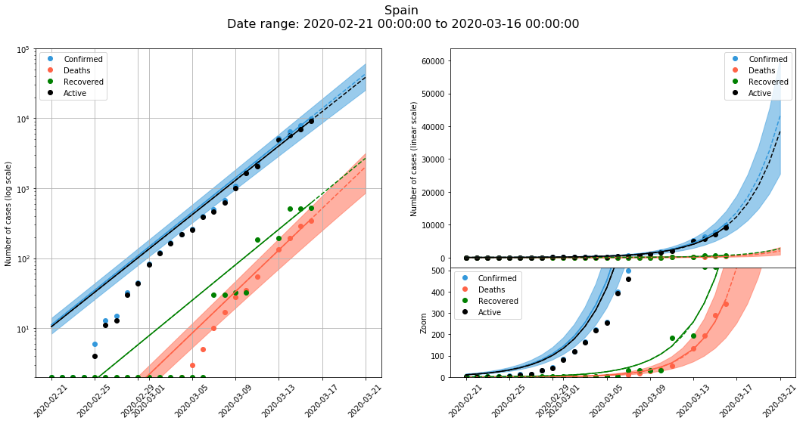

## Italy

#### 5 day prediction

<table id="T_3d24f222_687b_11ea_9c93_8560f2674376" ><thead>    <tr>        <th class="blank level0" ></th>        <th class="col_heading level0 col0" >Date (end of)</th>        <th class="col_heading level0 col1" >Confirmed</th>        <th class="col_heading level0 col2" >Deaths</th>        <th class="col_heading level0 col3" >Recovered</th>    </tr></thead><tbody>
                <tr>
                        <th id="T_3d24f222_687b_11ea_9c93_8560f2674376level0_row0" class="row_heading level0 row0" >25</th>
                        <td id="T_3d24f222_687b_11ea_9c93_8560f2674376row0_col0" class="data row0 col0" >Tuesday 17 March 2020</td>
                        <td id="T_3d24f222_687b_11ea_9c93_8560f2674376row0_col1" class="data row0 col1" >31803</td>
                        <td id="T_3d24f222_687b_11ea_9c93_8560f2674376row0_col2" class="data row0 col2" >2446</td>
                        <td id="T_3d24f222_687b_11ea_9c93_8560f2674376row0_col3" class="data row0 col3" >3391</td>
            </tr>
            <tr>
                        <th id="T_3d24f222_687b_11ea_9c93_8560f2674376level0_row1" class="row_heading level0 row1" >26</th>
                        <td id="T_3d24f222_687b_11ea_9c93_8560f2674376row1_col0" class="data row1 col0" >Wednesday 18 March 2020</td>
                        <td id="T_3d24f222_687b_11ea_9c93_8560f2674376row1_col1" class="data row1 col1" >35570</td>
                        <td id="T_3d24f222_687b_11ea_9c93_8560f2674376row1_col2" class="data row1 col2" >2746</td>
                        <td id="T_3d24f222_687b_11ea_9c93_8560f2674376row1_col3" class="data row1 col3" >4127</td>
            </tr>
            <tr>
                        <th id="T_3d24f222_687b_11ea_9c93_8560f2674376level0_row2" class="row_heading level0 row2" >27</th>
                        <td id="T_3d24f222_687b_11ea_9c93_8560f2674376row2_col0" class="data row2 col0" >Thursday 19 March 2020</td>
                        <td id="T_3d24f222_687b_11ea_9c93_8560f2674376row2_col1" class="data row2 col1" >39279</td>
                        <td id="T_3d24f222_687b_11ea_9c93_8560f2674376row2_col2" class="data row2 col2" >3020</td>
                        <td id="T_3d24f222_687b_11ea_9c93_8560f2674376row2_col3" class="data row2 col3" >5023</td>
            </tr>
            <tr>
                        <th id="T_3d24f222_687b_11ea_9c93_8560f2674376level0_row3" class="row_heading level0 row3" >28</th>
                        <td id="T_3d24f222_687b_11ea_9c93_8560f2674376row3_col0" class="data row3 col0" >Friday 20 March 2020</td>
                        <td id="T_3d24f222_687b_11ea_9c93_8560f2674376row3_col1" class="data row3 col1" >42841</td>
                        <td id="T_3d24f222_687b_11ea_9c93_8560f2674376row3_col2" class="data row3 col2" >3261</td>
                        <td id="T_3d24f222_687b_11ea_9c93_8560f2674376row3_col3" class="data row3 col3" >6113</td>
            </tr>
            <tr>
                        <th id="T_3d24f222_687b_11ea_9c93_8560f2674376level0_row4" class="row_heading level0 row4" >29</th>
                        <td id="T_3d24f222_687b_11ea_9c93_8560f2674376row4_col0" class="data row4 col0" >Saturday 21 March 2020</td>
                        <td id="T_3d24f222_687b_11ea_9c93_8560f2674376row4_col1" class="data row4 col1" >46182</td>
                        <td id="T_3d24f222_687b_11ea_9c93_8560f2674376row4_col2" class="data row4 col2" >3466</td>
                        <td id="T_3d24f222_687b_11ea_9c93_8560f2674376row4_col3" class="data row4 col3" >7439</td>
            </tr>
    </tbody></table>

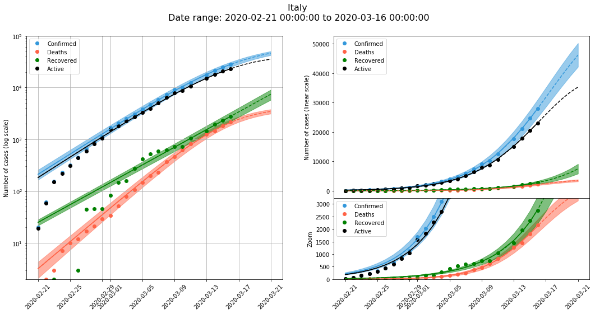

## France

#### 5 day prediction

<table id="T_3e47a6fe_687b_11ea_9c93_8560f2674376" ><thead>    <tr>        <th class="blank level0" ></th>        <th class="col_heading level0 col0" >Date (end of)</th>        <th class="col_heading level0 col1" >Confirmed</th>        <th class="col_heading level0 col2" >Deaths</th>        <th class="col_heading level0 col3" >Recovered</th>    </tr></thead><tbody>
                <tr>
                        <th id="T_3e47a6fe_687b_11ea_9c93_8560f2674376level0_row0" class="row_heading level0 row0" >24</th>
                        <td id="T_3e47a6fe_687b_11ea_9c93_8560f2674376row0_col0" class="data row0 col0" >Tuesday 17 March 2020</td>
                        <td id="T_3e47a6fe_687b_11ea_9c93_8560f2674376row0_col1" class="data row0 col1" >8107</td>
                        <td id="T_3e47a6fe_687b_11ea_9c93_8560f2674376row0_col2" class="data row0 col2" >182</td>
                        <td id="T_3e47a6fe_687b_11ea_9c93_8560f2674376row0_col3" class="data row0 col3" >14</td>
            </tr>
            <tr>
                        <th id="T_3e47a6fe_687b_11ea_9c93_8560f2674376level0_row1" class="row_heading level0 row1" >25</th>
                        <td id="T_3e47a6fe_687b_11ea_9c93_8560f2674376row1_col0" class="data row1 col0" >Wednesday 18 March 2020</td>
                        <td id="T_3e47a6fe_687b_11ea_9c93_8560f2674376row1_col1" class="data row1 col1" >10171</td>
                        <td id="T_3e47a6fe_687b_11ea_9c93_8560f2674376row1_col2" class="data row1 col2" >234</td>
                        <td id="T_3e47a6fe_687b_11ea_9c93_8560f2674376row1_col3" class="data row1 col3" >14</td>
            </tr>
            <tr>
                        <th id="T_3e47a6fe_687b_11ea_9c93_8560f2674376level0_row2" class="row_heading level0 row2" >26</th>
                        <td id="T_3e47a6fe_687b_11ea_9c93_8560f2674376row2_col0" class="data row2 col0" >Thursday 19 March 2020</td>
                        <td id="T_3e47a6fe_687b_11ea_9c93_8560f2674376row2_col1" class="data row2 col1" >12759</td>
                        <td id="T_3e47a6fe_687b_11ea_9c93_8560f2674376row2_col2" class="data row2 col2" >301</td>
                        <td id="T_3e47a6fe_687b_11ea_9c93_8560f2674376row2_col3" class="data row2 col3" >14</td>
            </tr>
            <tr>
                        <th id="T_3e47a6fe_687b_11ea_9c93_8560f2674376level0_row3" class="row_heading level0 row3" >27</th>
                        <td id="T_3e47a6fe_687b_11ea_9c93_8560f2674376row3_col0" class="data row3 col0" >Friday 20 March 2020</td>
                        <td id="T_3e47a6fe_687b_11ea_9c93_8560f2674376row3_col1" class="data row3 col1" >16006</td>
                        <td id="T_3e47a6fe_687b_11ea_9c93_8560f2674376row3_col2" class="data row3 col2" >387</td>
                        <td id="T_3e47a6fe_687b_11ea_9c93_8560f2674376row3_col3" class="data row3 col3" >15</td>
            </tr>
            <tr>
                        <th id="T_3e47a6fe_687b_11ea_9c93_8560f2674376level0_row4" class="row_heading level0 row4" >28</th>
                        <td id="T_3e47a6fe_687b_11ea_9c93_8560f2674376row4_col0" class="data row4 col0" >Saturday 21 March 2020</td>
                        <td id="T_3e47a6fe_687b_11ea_9c93_8560f2674376row4_col1" class="data row4 col1" >20080</td>
                        <td id="T_3e47a6fe_687b_11ea_9c93_8560f2674376row4_col2" class="data row4 col2" >498</td>
                        <td id="T_3e47a6fe_687b_11ea_9c93_8560f2674376row4_col3" class="data row4 col3" >15</td>
            </tr>
    </tbody></table>

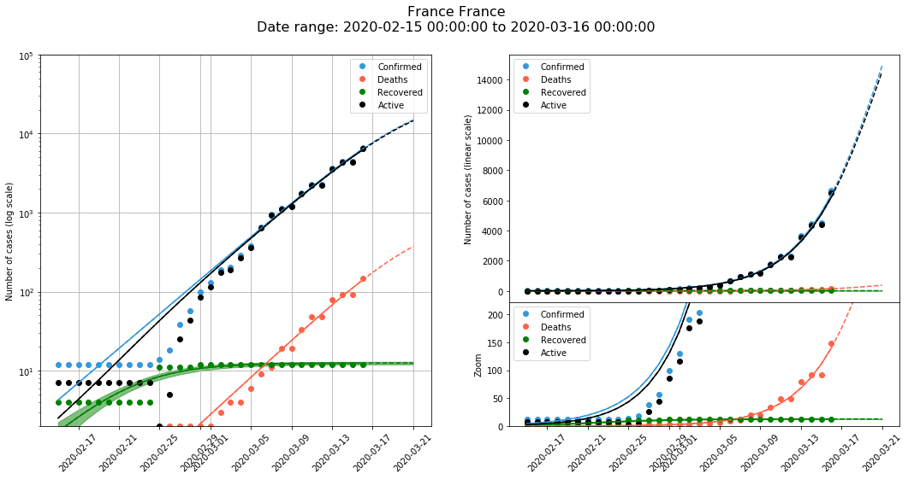

## Germany

#### 5 day prediction

<table id="T_3f44cdc0_687b_11ea_9c93_8560f2674376" ><thead>    <tr>        <th class="blank level0" ></th>        <th class="col_heading level0 col0" >Date (end of)</th>        <th class="col_heading level0 col1" >Confirmed</th>        <th class="col_heading level0 col2" >Deaths</th>        <th class="col_heading level0 col3" >Recovered</th>    </tr></thead><tbody>
                <tr>
                        <th id="T_3f44cdc0_687b_11ea_9c93_8560f2674376level0_row0" class="row_heading level0 row0" >24</th>
                        <td id="T_3f44cdc0_687b_11ea_9c93_8560f2674376row0_col0" class="data row0 col0" >Tuesday 17 March 2020</td>
                        <td id="T_3f44cdc0_687b_11ea_9c93_8560f2674376row0_col1" class="data row0 col1" >9621</td>
                        <td id="T_3f44cdc0_687b_11ea_9c93_8560f2674376row0_col2" class="data row0 col2" >24</td>
                        <td id="T_3f44cdc0_687b_11ea_9c93_8560f2674376row0_col3" class="data row0 col3" >57</td>
            </tr>
            <tr>
                        <th id="T_3f44cdc0_687b_11ea_9c93_8560f2674376level0_row1" class="row_heading level0 row1" >25</th>
                        <td id="T_3f44cdc0_687b_11ea_9c93_8560f2674376row1_col0" class="data row1 col0" >Wednesday 18 March 2020</td>
                        <td id="T_3f44cdc0_687b_11ea_9c93_8560f2674376row1_col1" class="data row1 col1" >12499</td>
                        <td id="T_3f44cdc0_687b_11ea_9c93_8560f2674376row1_col2" class="data row1 col2" >35</td>
                        <td id="T_3f44cdc0_687b_11ea_9c93_8560f2674376row1_col3" class="data row1 col3" >62</td>
            </tr>
            <tr>
                        <th id="T_3f44cdc0_687b_11ea_9c93_8560f2674376level0_row2" class="row_heading level0 row2" >26</th>
                        <td id="T_3f44cdc0_687b_11ea_9c93_8560f2674376row2_col0" class="data row2 col0" >Thursday 19 March 2020</td>
                        <td id="T_3f44cdc0_687b_11ea_9c93_8560f2674376row2_col1" class="data row2 col1" >16240</td>
                        <td id="T_3f44cdc0_687b_11ea_9c93_8560f2674376row2_col2" class="data row2 col2" >50</td>
                        <td id="T_3f44cdc0_687b_11ea_9c93_8560f2674376row2_col3" class="data row2 col3" >69</td>
            </tr>
            <tr>
                        <th id="T_3f44cdc0_687b_11ea_9c93_8560f2674376level0_row3" class="row_heading level0 row3" >27</th>
                        <td id="T_3f44cdc0_687b_11ea_9c93_8560f2674376row3_col0" class="data row3 col0" >Friday 20 March 2020</td>
                        <td id="T_3f44cdc0_687b_11ea_9c93_8560f2674376row3_col1" class="data row3 col1" >21099</td>
                        <td id="T_3f44cdc0_687b_11ea_9c93_8560f2674376row3_col2" class="data row3 col2" >71</td>
                        <td id="T_3f44cdc0_687b_11ea_9c93_8560f2674376row3_col3" class="data row3 col3" >75</td>
            </tr>
            <tr>
                        <th id="T_3f44cdc0_687b_11ea_9c93_8560f2674376level0_row4" class="row_heading level0 row4" >28</th>
                        <td id="T_3f44cdc0_687b_11ea_9c93_8560f2674376row4_col0" class="data row4 col0" >Saturday 21 March 2020</td>
                        <td id="T_3f44cdc0_687b_11ea_9c93_8560f2674376row4_col1" class="data row4 col1" >27413</td>
                        <td id="T_3f44cdc0_687b_11ea_9c93_8560f2674376row4_col2" class="data row4 col2" >102</td>
                        <td id="T_3f44cdc0_687b_11ea_9c93_8560f2674376row4_col3" class="data row4 col3" >83</td>
            </tr>
    </tbody></table>

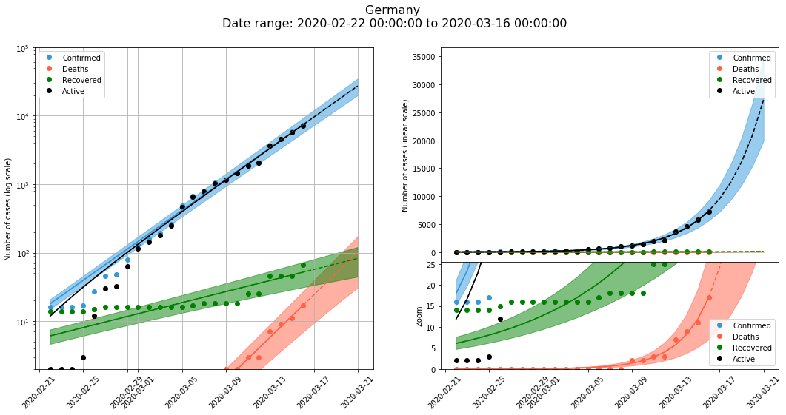

## United Kingdom

#### 5 day prediction

<table id="T_4040b644_687b_11ea_9c93_8560f2674376" ><thead>    <tr>        <th class="blank level0" ></th>        <th class="col_heading level0 col0" >Date (end of)</th>        <th class="col_heading level0 col1" >Confirmed</th>        <th class="col_heading level0 col2" >Deaths</th>        <th class="col_heading level0 col3" >Recovered</th>    </tr></thead><tbody>
                <tr>
                        <th id="T_4040b644_687b_11ea_9c93_8560f2674376level0_row0" class="row_heading level0 row0" >24</th>
                        <td id="T_4040b644_687b_11ea_9c93_8560f2674376row0_col0" class="data row0 col0" >Tuesday 17 March 2020</td>
                        <td id="T_4040b644_687b_11ea_9c93_8560f2674376row0_col1" class="data row0 col1" >2014</td>
                        <td id="T_4040b644_687b_11ea_9c93_8560f2674376row0_col2" class="data row0 col2" >82</td>
                        <td id="T_4040b644_687b_11ea_9c93_8560f2674376row0_col3" class="data row0 col3" >23</td>
            </tr>
            <tr>
                        <th id="T_4040b644_687b_11ea_9c93_8560f2674376level0_row1" class="row_heading level0 row1" >25</th>
                        <td id="T_4040b644_687b_11ea_9c93_8560f2674376row1_col0" class="data row1 col0" >Wednesday 18 March 2020</td>
                        <td id="T_4040b644_687b_11ea_9c93_8560f2674376row1_col1" class="data row1 col1" >2535</td>
                        <td id="T_4040b644_687b_11ea_9c93_8560f2674376row1_col2" class="data row1 col2" >124</td>
                        <td id="T_4040b644_687b_11ea_9c93_8560f2674376row1_col3" class="data row1 col3" >24</td>
            </tr>
            <tr>
                        <th id="T_4040b644_687b_11ea_9c93_8560f2674376level0_row2" class="row_heading level0 row2" >26</th>
                        <td id="T_4040b644_687b_11ea_9c93_8560f2674376row2_col0" class="data row2 col0" >Thursday 19 March 2020</td>
                        <td id="T_4040b644_687b_11ea_9c93_8560f2674376row2_col1" class="data row2 col1" >3190</td>
                        <td id="T_4040b644_687b_11ea_9c93_8560f2674376row2_col2" class="data row2 col2" >187</td>
                        <td id="T_4040b644_687b_11ea_9c93_8560f2674376row2_col3" class="data row2 col3" >26</td>
            </tr>
            <tr>
                        <th id="T_4040b644_687b_11ea_9c93_8560f2674376level0_row3" class="row_heading level0 row3" >27</th>
                        <td id="T_4040b644_687b_11ea_9c93_8560f2674376row3_col0" class="data row3 col0" >Friday 20 March 2020</td>
                        <td id="T_4040b644_687b_11ea_9c93_8560f2674376row3_col1" class="data row3 col1" >4014</td>
                        <td id="T_4040b644_687b_11ea_9c93_8560f2674376row3_col2" class="data row3 col2" >282</td>
                        <td id="T_4040b644_687b_11ea_9c93_8560f2674376row3_col3" class="data row3 col3" >27</td>
            </tr>
            <tr>
                        <th id="T_4040b644_687b_11ea_9c93_8560f2674376level0_row4" class="row_heading level0 row4" >28</th>
                        <td id="T_4040b644_687b_11ea_9c93_8560f2674376row4_col0" class="data row4 col0" >Saturday 21 March 2020</td>
                        <td id="T_4040b644_687b_11ea_9c93_8560f2674376row4_col1" class="data row4 col1" >5051</td>
                        <td id="T_4040b644_687b_11ea_9c93_8560f2674376row4_col2" class="data row4 col2" >425</td>
                        <td id="T_4040b644_687b_11ea_9c93_8560f2674376row4_col3" class="data row4 col3" >29</td>
            </tr>
    </tbody></table>

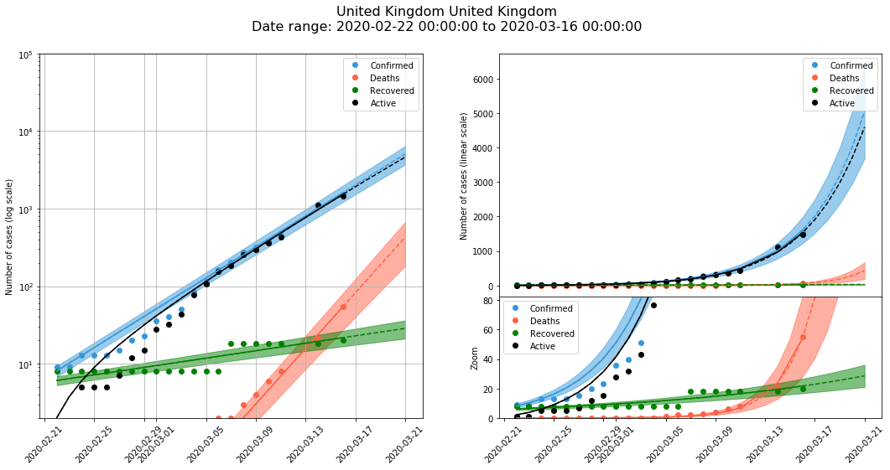

## Sweden

#### 5 day prediction

<table id="T_412ef7c8_687b_11ea_9c93_8560f2674376" ><thead>    <tr>        <th class="blank level0" ></th>        <th class="col_heading level0 col0" >Date (end of)</th>        <th class="col_heading level0 col1" >Confirmed</th>        <th class="col_heading level0 col2" >Deaths</th>        <th class="col_heading level0 col3" >Recovered</th>    </tr></thead><tbody>
                <tr>
                        <th id="T_412ef7c8_687b_11ea_9c93_8560f2674376level0_row0" class="row_heading level0 row0" >24</th>
                        <td id="T_412ef7c8_687b_11ea_9c93_8560f2674376row0_col0" class="data row0 col0" >Tuesday 17 March 2020</td>
                        <td id="T_412ef7c8_687b_11ea_9c93_8560f2674376row0_col1" class="data row0 col1" >1194</td>
                        <td id="T_412ef7c8_687b_11ea_9c93_8560f2674376row0_col2" class="data row0 col2" >10</td>
                        <td id="T_412ef7c8_687b_11ea_9c93_8560f2674376row0_col3" class="data row0 col3" >nan</td>
            </tr>
            <tr>
                        <th id="T_412ef7c8_687b_11ea_9c93_8560f2674376level0_row1" class="row_heading level0 row1" >25</th>
                        <td id="T_412ef7c8_687b_11ea_9c93_8560f2674376row1_col0" class="data row1 col0" >Wednesday 18 March 2020</td>
                        <td id="T_412ef7c8_687b_11ea_9c93_8560f2674376row1_col1" class="data row1 col1" >1245</td>
                        <td id="T_412ef7c8_687b_11ea_9c93_8560f2674376row1_col2" class="data row1 col2" >17</td>
                        <td id="T_412ef7c8_687b_11ea_9c93_8560f2674376row1_col3" class="data row1 col3" >nan</td>
            </tr>
            <tr>
                        <th id="T_412ef7c8_687b_11ea_9c93_8560f2674376level0_row2" class="row_heading level0 row2" >26</th>
                        <td id="T_412ef7c8_687b_11ea_9c93_8560f2674376row2_col0" class="data row2 col0" >Thursday 19 March 2020</td>
                        <td id="T_412ef7c8_687b_11ea_9c93_8560f2674376row2_col1" class="data row2 col1" >1280</td>
                        <td id="T_412ef7c8_687b_11ea_9c93_8560f2674376row2_col2" class="data row2 col2" >30</td>
                        <td id="T_412ef7c8_687b_11ea_9c93_8560f2674376row2_col3" class="data row2 col3" >nan</td>
            </tr>
            <tr>
                        <th id="T_412ef7c8_687b_11ea_9c93_8560f2674376level0_row3" class="row_heading level0 row3" >27</th>
                        <td id="T_412ef7c8_687b_11ea_9c93_8560f2674376row3_col0" class="data row3 col0" >Friday 20 March 2020</td>
                        <td id="T_412ef7c8_687b_11ea_9c93_8560f2674376row3_col1" class="data row3 col1" >1305</td>
                        <td id="T_412ef7c8_687b_11ea_9c93_8560f2674376row3_col2" class="data row3 col2" >52</td>
                        <td id="T_412ef7c8_687b_11ea_9c93_8560f2674376row3_col3" class="data row3 col3" >nan</td>
            </tr>
            <tr>
                        <th id="T_412ef7c8_687b_11ea_9c93_8560f2674376level0_row4" class="row_heading level0 row4" >28</th>
                        <td id="T_412ef7c8_687b_11ea_9c93_8560f2674376row4_col0" class="data row4 col0" >Saturday 21 March 2020</td>
                        <td id="T_412ef7c8_687b_11ea_9c93_8560f2674376row4_col1" class="data row4 col1" >1321</td>
                        <td id="T_412ef7c8_687b_11ea_9c93_8560f2674376row4_col2" class="data row4 col2" >89</td>
                        <td id="T_412ef7c8_687b_11ea_9c93_8560f2674376row4_col3" class="data row4 col3" >nan</td>
            </tr>
    </tbody></table>

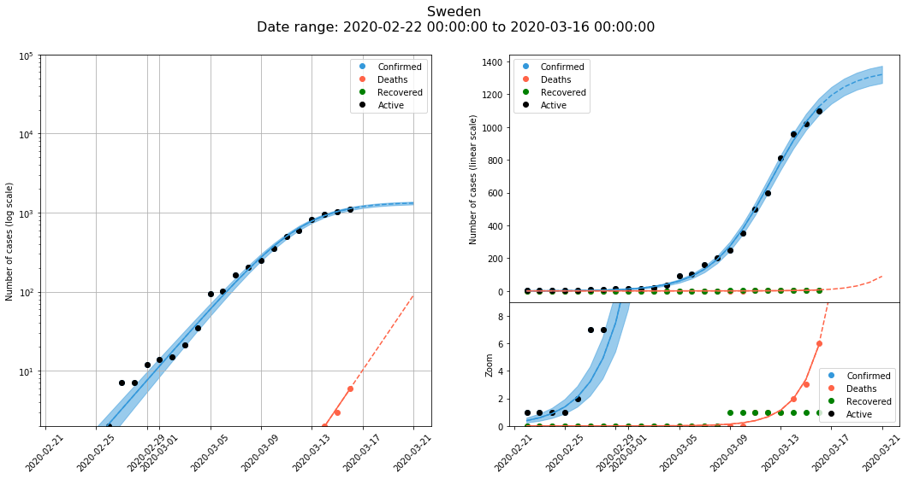

## Netherlands

#### 5 day prediction

<table id="T_4229818e_687b_11ea_9c93_8560f2674376" ><thead>    <tr>        <th class="blank level0" ></th>        <th class="col_heading level0 col0" >Date (end of)</th>        <th class="col_heading level0 col1" >Confirmed</th>        <th class="col_heading level0 col2" >Deaths</th>        <th class="col_heading level0 col3" >Recovered</th>    </tr></thead><tbody>
                <tr>
                        <th id="T_4229818e_687b_11ea_9c93_8560f2674376level0_row0" class="row_heading level0 row0" >24</th>
                        <td id="T_4229818e_687b_11ea_9c93_8560f2674376row0_col0" class="data row0 col0" >Tuesday 17 March 2020</td>
                        <td id="T_4229818e_687b_11ea_9c93_8560f2674376row0_col1" class="data row0 col1" >1816</td>
                        <td id="T_4229818e_687b_11ea_9c93_8560f2674376row0_col2" class="data row0 col2" >34</td>
                        <td id="T_4229818e_687b_11ea_9c93_8560f2674376row0_col3" class="data row0 col3" >nan</td>
            </tr>
            <tr>
                        <th id="T_4229818e_687b_11ea_9c93_8560f2674376level0_row1" class="row_heading level0 row1" >25</th>
                        <td id="T_4229818e_687b_11ea_9c93_8560f2674376row1_col0" class="data row1 col0" >Wednesday 18 March 2020</td>
                        <td id="T_4229818e_687b_11ea_9c93_8560f2674376row1_col1" class="data row1 col1" >2274</td>
                        <td id="T_4229818e_687b_11ea_9c93_8560f2674376row1_col2" class="data row1 col2" >46</td>
                        <td id="T_4229818e_687b_11ea_9c93_8560f2674376row1_col3" class="data row1 col3" >nan</td>
            </tr>
            <tr>
                        <th id="T_4229818e_687b_11ea_9c93_8560f2674376level0_row2" class="row_heading level0 row2" >26</th>
                        <td id="T_4229818e_687b_11ea_9c93_8560f2674376row2_col0" class="data row2 col0" >Thursday 19 March 2020</td>
                        <td id="T_4229818e_687b_11ea_9c93_8560f2674376row2_col1" class="data row2 col1" >2848</td>
                        <td id="T_4229818e_687b_11ea_9c93_8560f2674376row2_col2" class="data row2 col2" >63</td>
                        <td id="T_4229818e_687b_11ea_9c93_8560f2674376row2_col3" class="data row2 col3" >nan</td>
            </tr>
            <tr>
                        <th id="T_4229818e_687b_11ea_9c93_8560f2674376level0_row3" class="row_heading level0 row3" >27</th>
                        <td id="T_4229818e_687b_11ea_9c93_8560f2674376row3_col0" class="data row3 col0" >Friday 20 March 2020</td>
                        <td id="T_4229818e_687b_11ea_9c93_8560f2674376row3_col1" class="data row3 col1" >3566</td>
                        <td id="T_4229818e_687b_11ea_9c93_8560f2674376row3_col2" class="data row3 col2" >86</td>
                        <td id="T_4229818e_687b_11ea_9c93_8560f2674376row3_col3" class="data row3 col3" >nan</td>
            </tr>
            <tr>
                        <th id="T_4229818e_687b_11ea_9c93_8560f2674376level0_row4" class="row_heading level0 row4" >28</th>
                        <td id="T_4229818e_687b_11ea_9c93_8560f2674376row4_col0" class="data row4 col0" >Saturday 21 March 2020</td>
                        <td id="T_4229818e_687b_11ea_9c93_8560f2674376row4_col1" class="data row4 col1" >4465</td>
                        <td id="T_4229818e_687b_11ea_9c93_8560f2674376row4_col2" class="data row4 col2" >117</td>
                        <td id="T_4229818e_687b_11ea_9c93_8560f2674376row4_col3" class="data row4 col3" >nan</td>
            </tr>
    </tbody></table>

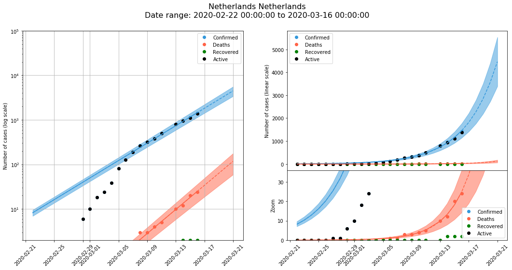

## Poland

#### 5 day prediction

<table id="T_43211d5e_687b_11ea_9c93_8560f2674376" ><thead>    <tr>        <th class="blank level0" ></th>        <th class="col_heading level0 col0" >Date (end of)</th>        <th class="col_heading level0 col1" >Confirmed</th>        <th class="col_heading level0 col2" >Deaths</th>        <th class="col_heading level0 col3" >Recovered</th>    </tr></thead><tbody>
                <tr>
                        <th id="T_43211d5e_687b_11ea_9c93_8560f2674376level0_row0" class="row_heading level0 row0" >24</th>
                        <td id="T_43211d5e_687b_11ea_9c93_8560f2674376row0_col0" class="data row0 col0" >Tuesday 17 March 2020</td>
                        <td id="T_43211d5e_687b_11ea_9c93_8560f2674376row0_col1" class="data row0 col1" >247</td>
                        <td id="T_43211d5e_687b_11ea_9c93_8560f2674376row0_col2" class="data row0 col2" >6</td>
                        <td id="T_43211d5e_687b_11ea_9c93_8560f2674376row0_col3" class="data row0 col3" >nan</td>
            </tr>
            <tr>
                        <th id="T_43211d5e_687b_11ea_9c93_8560f2674376level0_row1" class="row_heading level0 row1" >25</th>
                        <td id="T_43211d5e_687b_11ea_9c93_8560f2674376row1_col0" class="data row1 col0" >Wednesday 18 March 2020</td>
                        <td id="T_43211d5e_687b_11ea_9c93_8560f2674376row1_col1" class="data row1 col1" >344</td>
                        <td id="T_43211d5e_687b_11ea_9c93_8560f2674376row1_col2" class="data row1 col2" >9</td>
                        <td id="T_43211d5e_687b_11ea_9c93_8560f2674376row1_col3" class="data row1 col3" >nan</td>
            </tr>
            <tr>
                        <th id="T_43211d5e_687b_11ea_9c93_8560f2674376level0_row2" class="row_heading level0 row2" >26</th>
                        <td id="T_43211d5e_687b_11ea_9c93_8560f2674376row2_col0" class="data row2 col0" >Thursday 19 March 2020</td>
                        <td id="T_43211d5e_687b_11ea_9c93_8560f2674376row2_col1" class="data row2 col1" >479</td>
                        <td id="T_43211d5e_687b_11ea_9c93_8560f2674376row2_col2" class="data row2 col2" >13</td>
                        <td id="T_43211d5e_687b_11ea_9c93_8560f2674376row2_col3" class="data row2 col3" >nan</td>
            </tr>
            <tr>
                        <th id="T_43211d5e_687b_11ea_9c93_8560f2674376level0_row3" class="row_heading level0 row3" >27</th>
                        <td id="T_43211d5e_687b_11ea_9c93_8560f2674376row3_col0" class="data row3 col0" >Friday 20 March 2020</td>
                        <td id="T_43211d5e_687b_11ea_9c93_8560f2674376row3_col1" class="data row3 col1" >667</td>
                        <td id="T_43211d5e_687b_11ea_9c93_8560f2674376row3_col2" class="data row3 col2" >18</td>
                        <td id="T_43211d5e_687b_11ea_9c93_8560f2674376row3_col3" class="data row3 col3" >nan</td>
            </tr>
            <tr>
                        <th id="T_43211d5e_687b_11ea_9c93_8560f2674376level0_row4" class="row_heading level0 row4" >28</th>
                        <td id="T_43211d5e_687b_11ea_9c93_8560f2674376row4_col0" class="data row4 col0" >Saturday 21 March 2020</td>
                        <td id="T_43211d5e_687b_11ea_9c93_8560f2674376row4_col1" class="data row4 col1" >929</td>
                        <td id="T_43211d5e_687b_11ea_9c93_8560f2674376row4_col2" class="data row4 col2" >27</td>
                        <td id="T_43211d5e_687b_11ea_9c93_8560f2674376row4_col3" class="data row4 col3" >nan</td>
            </tr>
    </tbody></table>

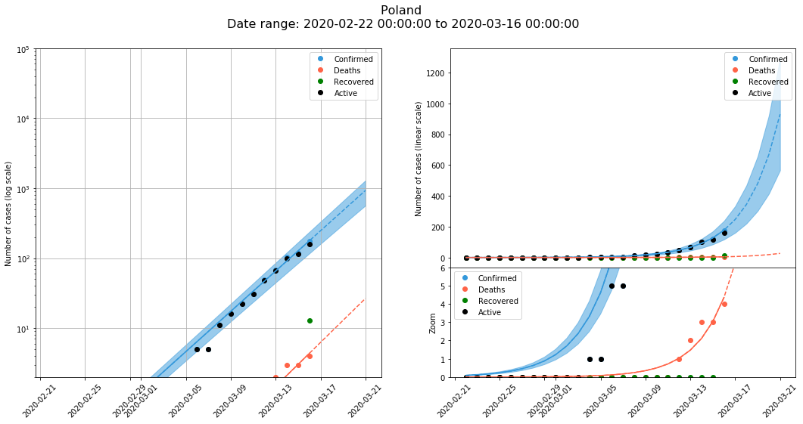

# United States

I use the combined data for all the states combined

    <class 'pandas._libs.tslibs.timestamps.Timestamp'>

#### 5 day prediction

<table id="T_4426cf00_687b_11ea_9c93_8560f2674376" ><thead>    <tr>        <th class="blank level0" ></th>        <th class="col_heading level0 col0" >Date (end of)</th>        <th class="col_heading level0 col1" >Confirmed</th>        <th class="col_heading level0 col2" >Deaths</th>        <th class="col_heading level0 col3" >Recovered</th>    </tr></thead><tbody>
                <tr>
                        <th id="T_4426cf00_687b_11ea_9c93_8560f2674376level0_row0" class="row_heading level0 row0" >21</th>
                        <td id="T_4426cf00_687b_11ea_9c93_8560f2674376row0_col0" class="data row0 col0" >Tuesday 17 March 2020</td>
                        <td id="T_4426cf00_687b_11ea_9c93_8560f2674376row0_col1" class="data row0 col1" >6058</td>
                        <td id="T_4426cf00_687b_11ea_9c93_8560f2674376row0_col2" class="data row0 col2" >98</td>
                        <td id="T_4426cf00_687b_11ea_9c93_8560f2674376row0_col3" class="data row0 col3" >14</td>
            </tr>
            <tr>
                        <th id="T_4426cf00_687b_11ea_9c93_8560f2674376level0_row1" class="row_heading level0 row1" >22</th>
                        <td id="T_4426cf00_687b_11ea_9c93_8560f2674376row1_col0" class="data row1 col0" >Wednesday 18 March 2020</td>
                        <td id="T_4426cf00_687b_11ea_9c93_8560f2674376row1_col1" class="data row1 col1" >7909</td>
                        <td id="T_4426cf00_687b_11ea_9c93_8560f2674376row1_col2" class="data row1 col2" >118</td>
                        <td id="T_4426cf00_687b_11ea_9c93_8560f2674376row1_col3" class="data row1 col3" >15</td>
            </tr>
            <tr>
                        <th id="T_4426cf00_687b_11ea_9c93_8560f2674376level0_row2" class="row_heading level0 row2" >23</th>
                        <td id="T_4426cf00_687b_11ea_9c93_8560f2674376row2_col0" class="data row2 col0" >Thursday 19 March 2020</td>
                        <td id="T_4426cf00_687b_11ea_9c93_8560f2674376row2_col1" class="data row2 col1" >10326</td>
                        <td id="T_4426cf00_687b_11ea_9c93_8560f2674376row2_col2" class="data row2 col2" >142</td>
                        <td id="T_4426cf00_687b_11ea_9c93_8560f2674376row2_col3" class="data row2 col3" >15</td>
            </tr>
            <tr>
                        <th id="T_4426cf00_687b_11ea_9c93_8560f2674376level0_row3" class="row_heading level0 row3" >24</th>
                        <td id="T_4426cf00_687b_11ea_9c93_8560f2674376row3_col0" class="data row3 col0" >Friday 20 March 2020</td>
                        <td id="T_4426cf00_687b_11ea_9c93_8560f2674376row3_col1" class="data row3 col1" >13480</td>
                        <td id="T_4426cf00_687b_11ea_9c93_8560f2674376row3_col2" class="data row3 col2" >170</td>
                        <td id="T_4426cf00_687b_11ea_9c93_8560f2674376row3_col3" class="data row3 col3" >16</td>
            </tr>
            <tr>
                        <th id="T_4426cf00_687b_11ea_9c93_8560f2674376level0_row4" class="row_heading level0 row4" >25</th>
                        <td id="T_4426cf00_687b_11ea_9c93_8560f2674376row4_col0" class="data row4 col0" >Saturday 21 March 2020</td>
                        <td id="T_4426cf00_687b_11ea_9c93_8560f2674376row4_col1" class="data row4 col1" >17598</td>
                        <td id="T_4426cf00_687b_11ea_9c93_8560f2674376row4_col2" class="data row4 col2" >205</td>
                        <td id="T_4426cf00_687b_11ea_9c93_8560f2674376row4_col3" class="data row4 col3" >17</td>
            </tr>
    </tbody></table>

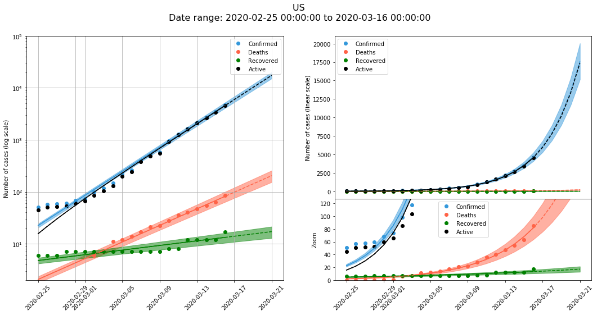

# Comparison of growth China Regions vs Other countries

These plots show the importance of rapid response and efficient control measures of infected people in China. Except for Hubei region, where the expansion of the virus was unexpected, the other regions have a very reduced number of Deaths in total. The other countries, especially in Europe, even with a month for preparation, shows very high infection and death rates.

### Confirmed Cases

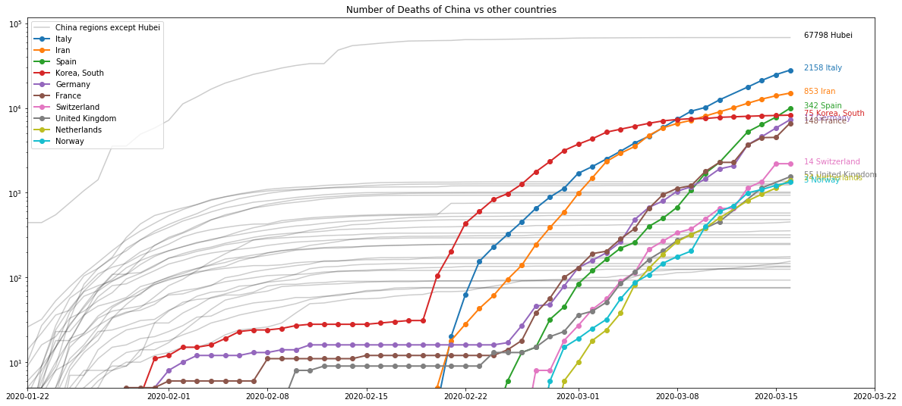

### Deaths

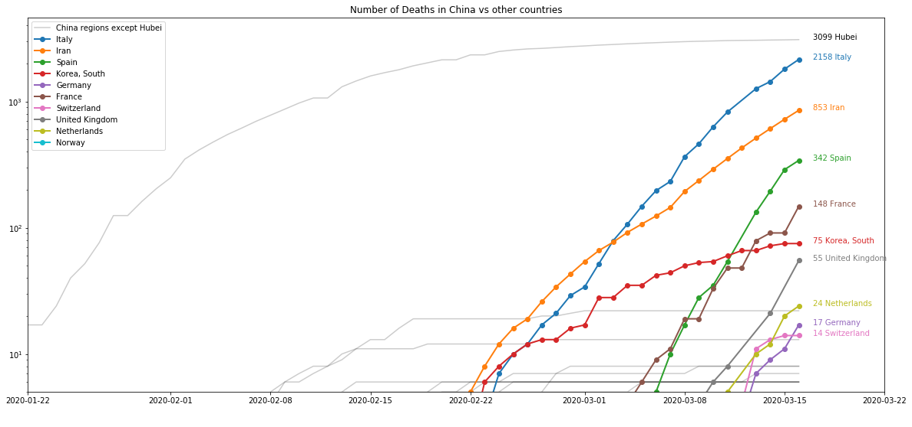

# Comparison of different countries, with a manual time delay to align them

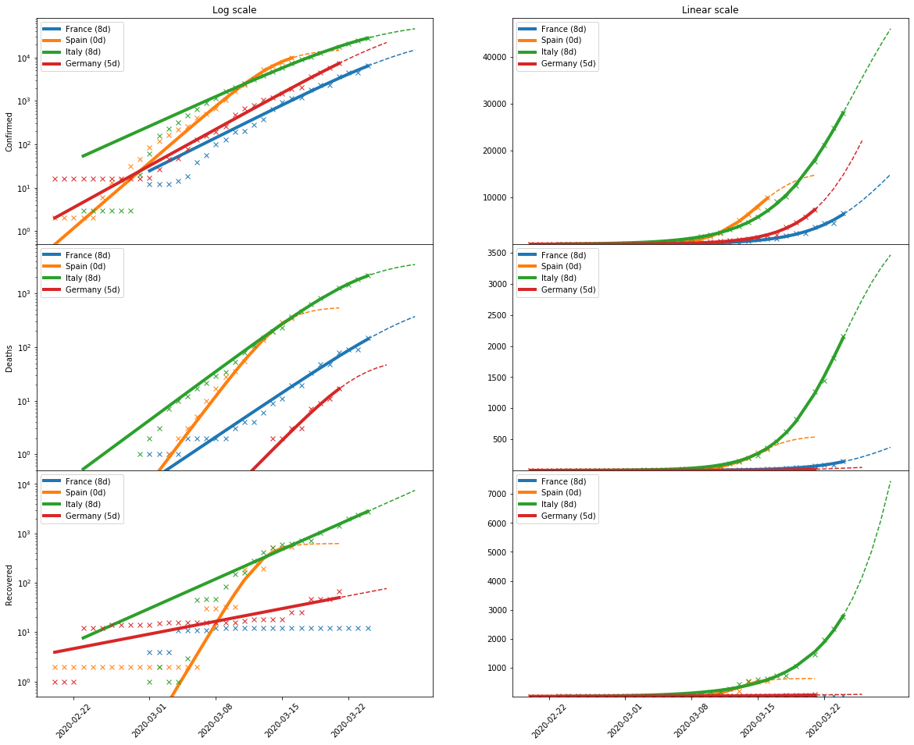

## Early onset: China regions

Most of the regions have almost completed the cycle and active cases are disappearing. Note that China Hubei (the original area) has a large number of confirmed cases (70000), but the other regions have very low number of cases, with number around 1200-500 or even less.

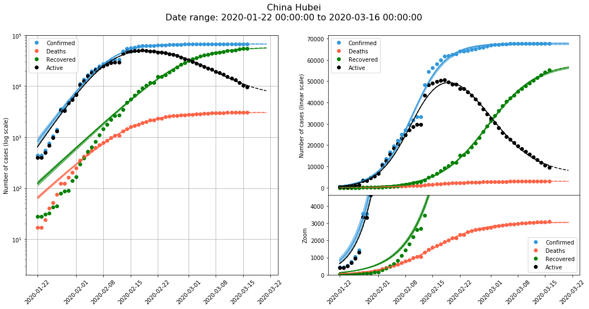

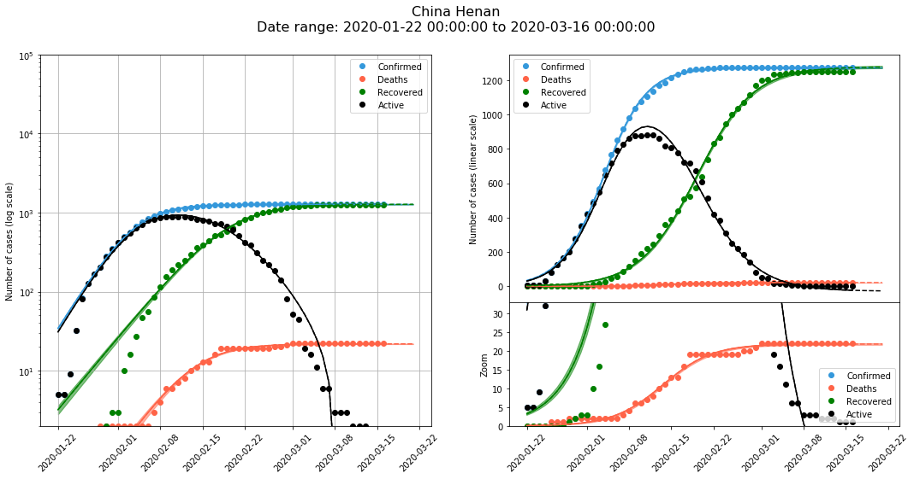

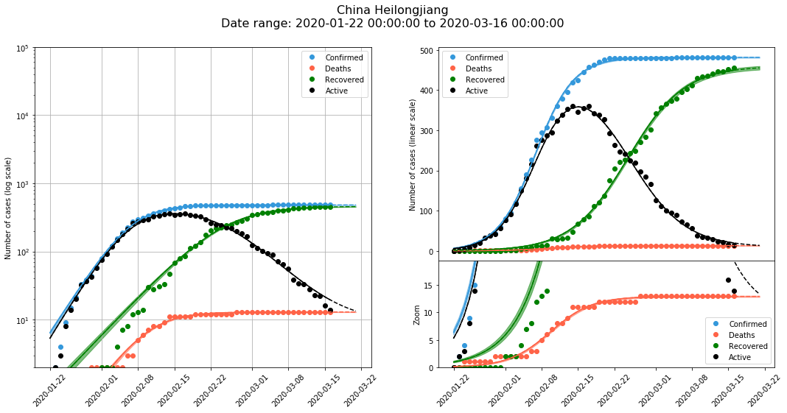

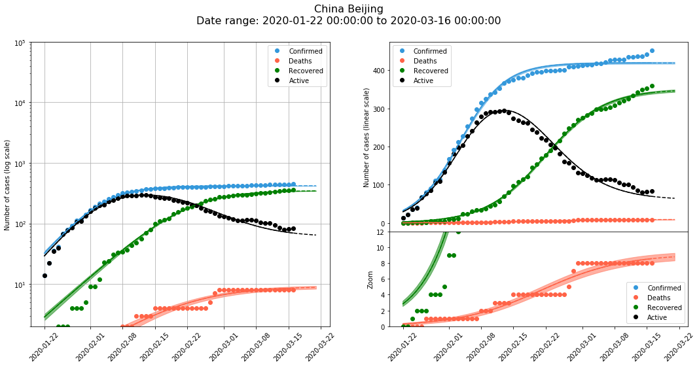

## Other countries in Asia

South Korea has a remarkable recovery rate, with many cases and a reduced number of deaths. Japan growth is moderate, much smaller than in European countries. Iran is showing hints of flattening, although it is curious that the number of recoveries has significantly slowed down while the number of deaths still follow a very exponential trend.

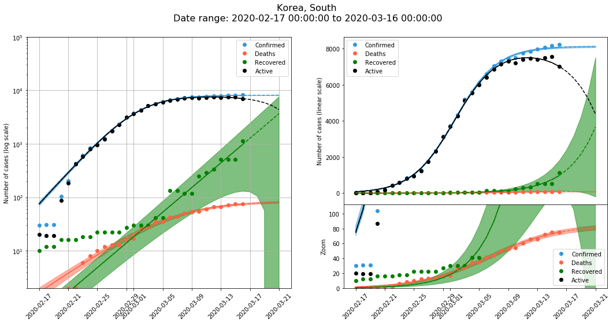

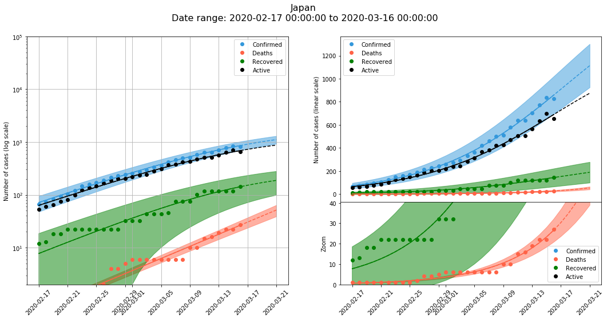

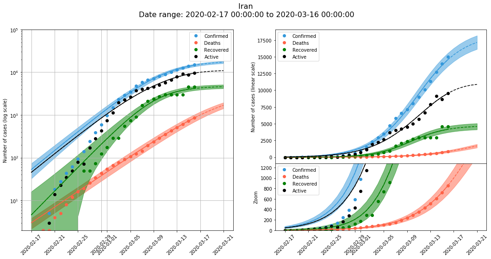

